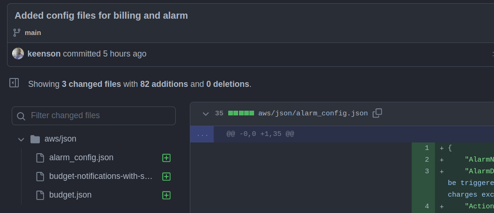
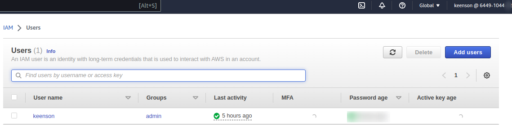
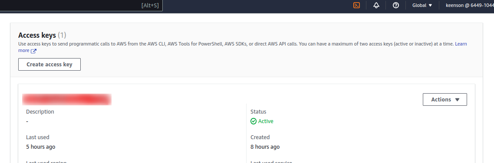
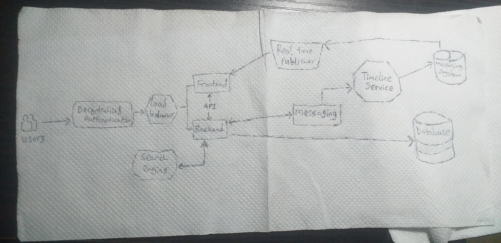
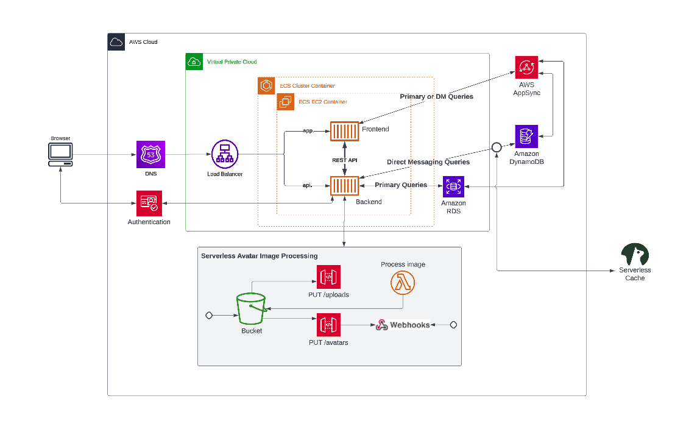
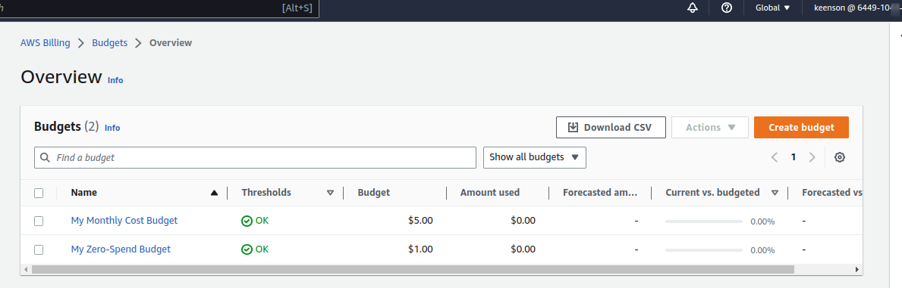
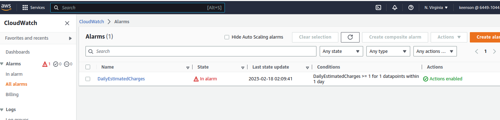

# Week 0 — Billing and Architecture

## Required Homework/Task


### Install AWS CLI
following the AWS documentation, I installed awscli which I then used to perform the budget and billing tasks

```sh
curl "https://awscli.amazonaws.com/awscli-exe-linux-x86_64.zip" -o "awscliv2.zip"
unzip awscliv2.zip
sudo ./aws/install
```




### Create an Admin User and Generate AWS Credential





### Recreate Conceptual design(Napkin)




### Recreate logical design




[Link to my logical diagram in lucidchart](https://lucid.app/lucidchart/07898a23-5a9e-453f-92cc-66609860e83f/edit?viewport_loc=-485%2C-78%2C3184%2C1620%2C0_0&invitationId=inv_10879534-8d99-41d5-8e0c-9135f8217753)


### Create Budget and Billing Alarm
I created two different budget for my account, one for $1 spend and the other for $2 spend. I also created billing alarm for daily usage

 


 


---

## Homework Challenges

- I successfully setup MFA and IAM role for on my root account
- I also deleted the credentials on my root account
