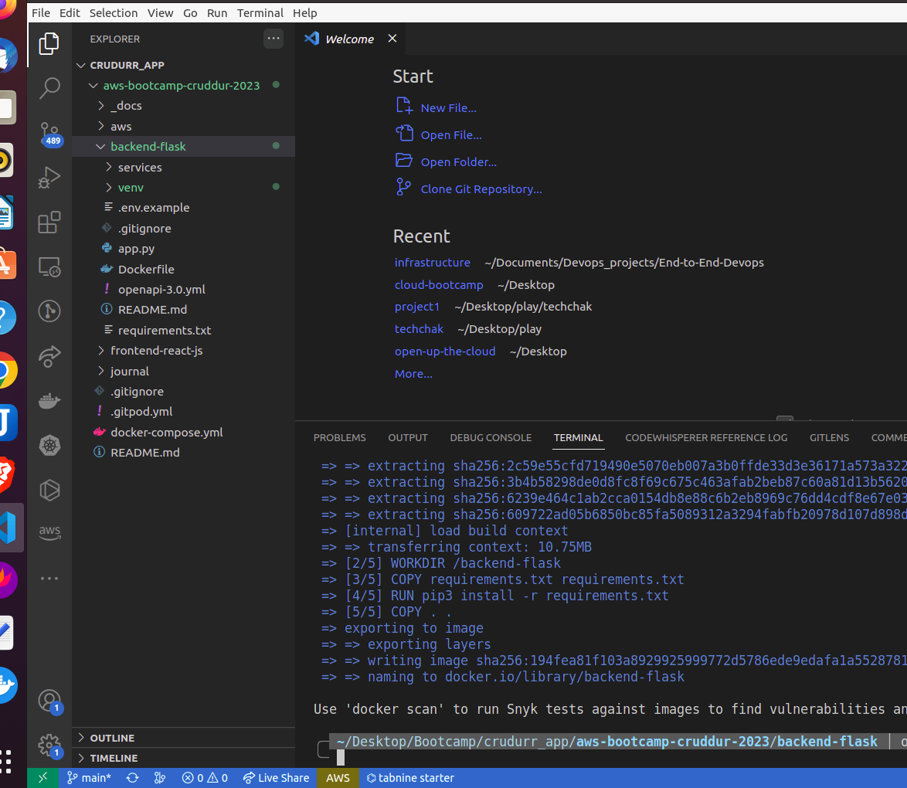
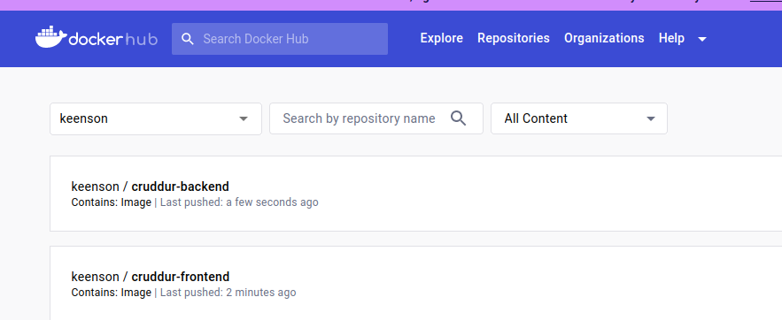
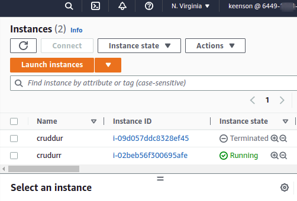
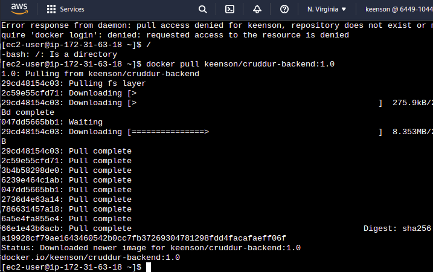
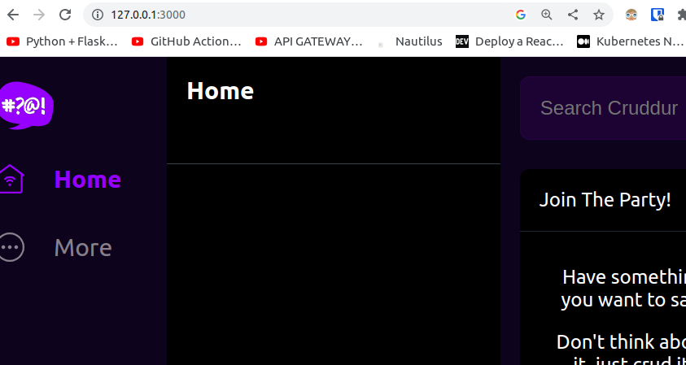
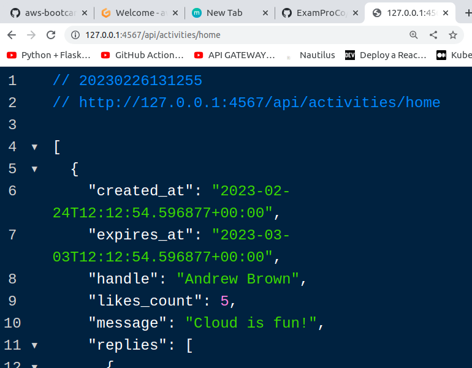

# Week 1 — App Containerization


# Homework
I impelemented the notification endpoint and the react page notification frontend on the fronend, while I also added the containers for for both dynamodb and postgres.

[here is the link to the notification page ](https://github.com/keenson/aws-bootcamp-cruddur-2023/blob/main/frontend-react-js/src/pages/NotificationsFeedPage.js)


# Homework challenges

### Tag and push docker images to dockerhub
```
docker tag aws-bootcamp-cruddur-2023-frontend-react-js keenson/cruddur-frontend:1.0

docker push keenson/cruddur-frontend:1.0


docker tag aws-bootcamp-cruddur-2023-backend-flask keenson/cruddur-backend:1.0

docker push keenson/cruddur-backend:1.0
```


- Building the docker images locally for backend
  - clone the github repo to my local machine
  - create a virtual environment and build image from the dockerfile
    > docker build -t backend-flask .  
    > docker run --rm -p 4567:4567 -it -e FRONTEND_URL='*' -e BACKEND_URL='*' backend-flask


- Building the docker images locally for frontend
  > cd into frontend
  > run `npm i`
  > docker build -t frontend-flask .




- I pushed the container images to my dockerhub repo
 



- I created an ec2 machine and installed docker at creation using userdata, then I pulled one of the images for the crudurr app which was in my dockerhub repo.





- I was also able to run the application on my local machine outside of gitpod/codespaces
  Here are images of the test of the app workin on my machine:
  
  
  
