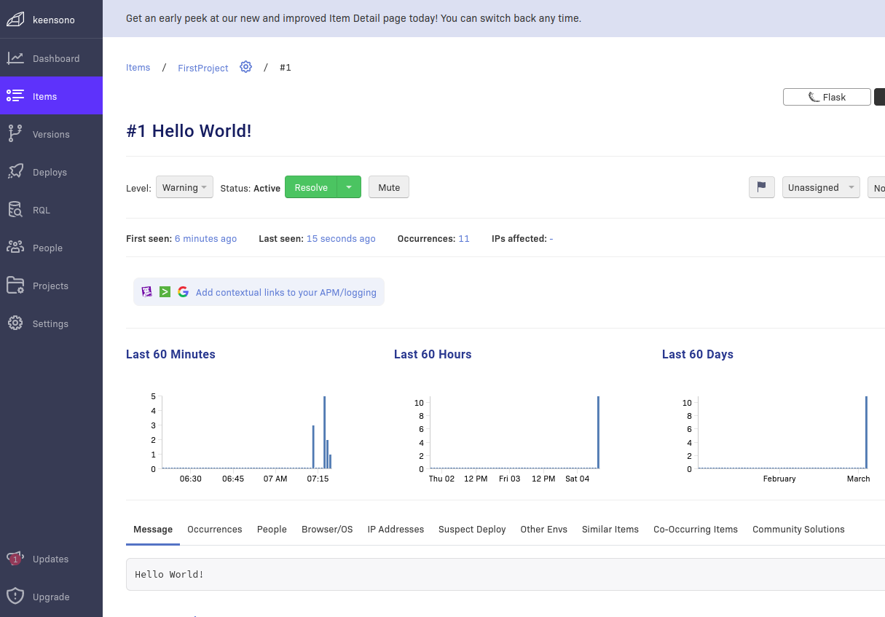

# Week 2 — Distributed Tracing

## Instrument Honeycomb with OTEL
I created  a free honeycomb account and included the api key in my project

```
export HONEYCOMB_API_KEY="my-honeycomb-api-key"
gp env HONEYCOMB_API_KEY="my-honeycomb-api-key"
```
```
gp env HONEYCOMB_SERVICE_NAME="backend-flask"
export HONEYCOMB_SERVICE_NAME="backend-flask"
```

#### Add the following environment variables to docker compose
```
OTEL_SERVICE_NAME: "backend-flask"
OTEL_EXPORTER_OTLP_ENDPOINT: "https://api.honeycomb.io"
OTEL_EXPORTER_OTLP_HEADERS: "x-honeycomb-team=${HONEYCOMB_API_KEY}"
```
#### paste the following in requirements.txt:
```
opentelemetry-api 
opentelemetry-sdk 
opentelemetry-exporter-otlp-proto-http 
opentelemetry-instrumentation-flask 
opentelemetry-instrumentation-requests
```

#### add to app.py:-
```
from opentelemetry import trace
from opentelemetry.instrumentation.flask import FlaskInstrumentor
from opentelemetry.instrumentation.requests import RequestsInstrumentor
from opentelemetry.exporter.otlp.proto.http.trace_exporter import OTLPSpanExporter
from opentelemetry.sdk.trace import TracerProvider
from opentelemetry.sdk.trace.export import BatchSpanProcessor
```

#### Initialize tracing and an exporter that can send data to Honeycomb
```python
provider = TracerProvider()
processor = BatchSpanProcessor(OTLPSpanExporter())
provider.add_span_processor(processor)
trace.set_tracer_provider(provider)
tracer = trace.get_tracer(__name__)
```

#### Initialize automatic instrumentation with Flask
```python
app = Flask(__name__)
FlaskInstrumentor().instrument_app(app)
RequestsInstrumentor().instrument()
```


      span = trace.get_current_span()
      now = datetime.now(timezone.utc).astimezone()
      span.set_attribute("app.now", now.isoformat())


***
## Instrument AWS X-Ray
Log into aws account, and search for xray.

Back to the application code,
```
cd into frontend
npm install
```
change directory to backend add to the requirements.txt

```
aws-xray-sdk
```
Export environment variable:
```
export AWS_REGION="us-east-1"
gp env AWS_REGION="us-east-1"
```
then run cli command to create xray group
```
aws xray create-group \
   --group-name "Cruddur" \
   --filter-expression "service(\"backend-flask\") {fault OR error}"
```

A container is needed to run a deamon service for xray to communicate with 

Add Deamon Service to Docker Compose
```
  xray-daemon:
    image: "amazon/aws-xray-daemon"
    environment:
      AWS_ACCESS_KEY_ID: "${AWS_ACCESS_KEY_ID}"
      AWS_SECRET_ACCESS_KEY: "${AWS_SECRET_ACCESS_KEY}"
      AWS_REGION: "us-east-1"
    command:
      - "xray -o -b xray-daemon:2000"
    ports:
      - 2000:2000/udp
```

We need to add these two env vars to our backend-flask in our docker-compose.yml file

      AWS_XRAY_URL: "*4567-${GITPOD_WORKSPACE_ID}.${GITPOD_WORKSPACE_CLUSTER_HOST}*"
      AWS_XRAY_DAEMON_ADDRESS: "xray-daemon:2000"


***
## Rollbar Integration

Add to `requirements.txt`

```
blinker
rollbar
```
Install deps

```sh
pip install -r requirements.txt
```
Get access token from rollbar account created and add to environment variable
We need to set our access token

```sh
export ROLLBAR_ACCESS_TOKEN=""
gp env ROLLBAR_ACCESS_TOKEN=""
```

Add to backend-flask for `docker-compose.yml`

```yml
ROLLBAR_ACCESS_TOKEN: "${ROLLBAR_ACCESS_TOKEN}"
```

Import for Rollbar

```py
import rollbar
import rollbar.contrib.flask
from flask import got_request_exception
```

```py
rollbar_access_token = os.getenv('ROLLBAR_ACCESS_TOKEN')
@app.before_first_request
def init_rollbar():
    """init rollbar module"""
    rollbar.init(
        # access token
        rollbar_access_token,
        # environment name
        'production',
        # server root directory, makes tracebacks prettier
        root=os.path.dirname(os.path.realpath(__file__)),
        # flask already sets up logging
        allow_logging_basic_config=False)

    # send exceptions from `app` to rollbar, using flask's signal system.
    got_request_exception.connect(rollbar.contrib.flask.report_exception, app)
```

We'll add an endpoint just for testing rollbar to `app.py`

```py
@app.route('/rollbar/test')
def rollbar_test():
    rollbar.report_message('Hello World!', 'warning')
    return "Hello World!"
```



